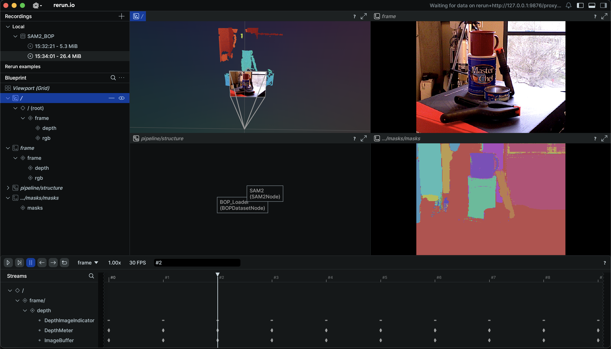

🌈 regenbogen 🌈
===================

A framework for 3D perception pipelines.

This project provides tools and utilities for building 3D perception pipelines.

Features
--------

* Modular design for flexible pipeline construction
* Support for various 3D perception tasks
* Native interactive visualization
* Extensible architecture for custom components

Getting Started
---------------

.. toctree::
   :maxdepth: 2
   :caption: Contents:

   installation
   quickstart
   nodes
   system_design
   api

Installation
============

Currently, 🌈 regenbogen 🌈 is in development. To install from source:

.. code-block:: bash

   git clone git@github.com:onosamo/regenbogen.git
   cd regenbogen
   uv sync --group full

Quick Start
===========

.. code-block:: bash

   uv run python examples/video_processing_demo.py

API Reference
=============

API documentation will be generated automatically as modules are added to the project.

Indices and tables
==================

* :ref:`genindex`
* :ref:`modindex`
* :ref:`search`

